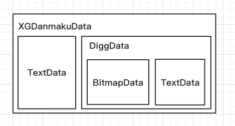

# DanmakuRenderEngine

[](/LICENSE)
[](https://developer.android.com/about/dashboards)

DanmakuRenderEngine 是一个轻量级、高扩展性的通用弹幕库，主要特性：

1. 高性能的渲染和绘制
2. 简单易用的接口和低成本的接入方式
3. 支持复杂的自定义弹幕样式
4. 支持自定义弹幕运动方式

[下载 Demo >>>]()

## 正在使用 DanmakuRenderEngine 的应用

|  |  |  |
|:-----------:|:-------:|:-----:|
| 西瓜视频 | 今日头条 | 懂车帝 |

## 快速接入

在依赖中添加：

```gradle
implementation 'com.ixigua.common:danmaku-render-engine:$latest_version'
```

在最简单的场景下，仅需要四步即可接入并开始播放弹幕：

1. 在播放器布局XML中放置和视频画面大小一致的`DanmakuView`
2. 通过`danmakuView.controller`拿到弹幕的控制器`DanmakuController`
3. 为每条弹幕构造一个`TextData`，默认情况仅需要填入`text`、`LayerType`和`showAtTime`字段
4. 调用`controller.setData()`设置数据，然后使用`controller.start()`即可开始播放弹幕

## 时间轴同步

### 弹幕控制

`DanmakuController`提供了四个与时间轴控制相关的方法：

```
fun start(playTime: Long)  // 播放，或从暂停状态恢复播放
fun pause()                // 暂停，画面上的弹幕停在原地
fun stop()                 // 停止，清除画面上的弹幕并重置时间轴
fun clear()                // 清屏，单独清除屏幕上已经显示的弹幕
```

### 播放同步

按照业界弹幕较通用的实现逻辑，播放器的回调和`DanmakuController`控制方法对应如下，  
如果有特殊需求也可以对 DanmakuRenderEngine 框架的控制逻辑进行定制：

| 播放器回调 | 含义 | DanmakuController方法 | 注释 |
|:--------:|:----:|:--------------------:|:----:|
|RenderStart|播放器首帧|start||
|VideoPause|播放暂停|pause||
|VideoResume|播放恢复|start||
|VideoStop|停止播放|pause|目的是让在视频播放完成后未滚动完的弹幕停留在原地|
|VideoReplay|重播|stop||
|VideoError|播放失败|pause||
|onSeekStart|开始Seek进度|pause||
|onSeekComplete|Seek进度完成|clear; if (isPlaying) {start}|Seek进度完毕后应该清屏|
|onBufferStart|开始缓冲|pause||
|onBufferEnd|缓冲完毕|start||

### 其他形态的业务

DanmakuRenderEngine 弹幕库并不与视频播放逻辑耦合，如果想要实现类似 QQ 空间的图片弹幕，做法也是类似的。

## 自定义运动方式

DanmakuRenderEngine 弹幕库的渲染结构根据运动方式的不同被分为不同的层（Layer），  
每个渲染层自己管理排版和渲染，渲染层之间则由`z-index`属性来控制层级顺序。

DanmakuRenderEngine 弹幕库默认情况下支持三种弹幕的运动方式：

1. ScrollLayer：从右往左滚动
2. TopCenterLayer：在屏幕顶部中间显示
3. BottomCenterLayer：在屏幕底部中间显示

若想开发自定义的运动方式，只需要按照`IRenderLayer`的要求对接口进行实现，调用`DanmakuController.addRenderLayer()`进行注册，  
然后在弹幕数据中指定`LayerType`为你定义的`Layer`，DanmakuRenderEngine 就会在渲染时自动将这条弹幕交给对应的`Layer`进行排版和绘制了。

## 自定义弹幕样式

### 定义

DanmakuRenderEngine 弹幕库在设计时将一条弹幕分成了数据实体（DanmakuData）和绘制实体(DrawItem)：

1. DanmakuData只包含这条弹幕的属性信息，在设置后除非主动修改否则内容不会变化
2. DrawItem定义这条弹幕是如何绘制的，同时包含这条弹幕绘制时的属性（x/y/宽/高等）
3. DrawItem在渲染过程中属性会被RenderLayer的逻辑不断修改，在弹幕移出屏幕后会被回收并复用

因此，想要自定义弹幕样式需要实现三个类：

1. CustomDanmakuData：数据实体类
2. CustomDrawItem：绘制实体类
3. CustomDrawItemFactory：绘制实体的工厂类

然后调用`DanmakuController.registerDrawItemFactory`对自定义的工厂类进行注册，  
这样 DanmakuRenderEngine 在遇到自定义的`CustomDanmakuData`时就会使用会注册的工厂类生成`CustomDrawItem`进行渲染了。

### 实现

基于组合优于继承的思想，DanmakuRenderEngine 弹幕库默认提供文字（TextData）和图片（BitmapData）两种弹幕样式，  
高级自定义弹幕样式则由业务方将上述两种样式组合而成。

自定义的Data和DrawItem需要定义相同的层级结构，  
在bindData或者x、y等属性发生变化时可以将新的值向下进行分发。

以西瓜视频的弹幕样式为例，在文字后面会跟一个点赞图标和点赞数：


而弹幕数据结构组合如下：



同时在DrawItem内，在绘制时能拿到绘制时的Canvas，  
上图中弹幕点赞结构的背景，就是使用Canvas绘制的。

## 弹幕设置

### 需求

通常情况下我们会有对弹幕属性进行修改的需求，例如：

1. 全屏后字体、行高变大，退出全屏变小
2. 点赞弹幕后字体变色
3. 全局修改字体大小、透明度等

在 DanmakuRenderEngine 框架中，主要通过`DanmakuController.config`来对弹幕进行控制

### 层叠与优先级

根据实际需求，在配置上设计了类似于CSS的层叠与优先级的概念。

首先`Config`中是全局配置字段，根据作用范围分为：

```kotlin
val debug = DebugConfig(this)
val common = CommonConfig(this)
val text = TextConfig(this)
val underline = UnderlineConfig(this)
val scroll = ScrollLayerConfig(this)
val top = TopCenterLayerConfig(this)
val bottom = BottomCenterLayerConfig(this)
```

以文字的`TextConfig`为例，有`size`、`color`等属性，  
而同时TextData中也有相同作用的`TextSize`、`TextColor`等属性。

若`TextData`定义了某条属性时，以`TextData`中定义的为准，  
在`TextData`中未定义时，则以`Config`中定义的为准。

例如如果在正文的`TextData`中不对`TextSize`赋值，而在点赞数字的`TextData`中对`TextSize`赋值，  
则当我们在进入全屏时增加`Config.text`中的`size`属性时，就能对弹幕的正文字体大小进行放大，同时点赞数字的大小则始终保持不变。

## 命令和事件

对于一个弹幕框架，通常来说会有两种需求：

1. 命令框架做一些事情，比如：
    1. 暂停一条弹幕
    2. 改变一条弹幕的颜色
2. 框架通知外部一些事情发生了，比如：
    1. 一条弹幕被添加进屏幕显示出来
    2. 一条弹幕被移出屏幕
    3. 一条弹幕的大小变化了

DanmakuRenderEngine框架针对这两类需求，设计了**命令**和**事件**两套机制来进行处理

### 命令

命令（DanmakuCommand）用于业务方通知弹幕框架做一些事情，  
主入口是`DanmakuController.executeCommand()`，例如：

```kotlin
mController?.executeCommand(CMD_PAUSE_ITEM, data)           // 暂停一条弹幕
mController?.executeCommand(CMD_RESUME_ITEM, data)          // 恢复一条弹幕
mController?.executeCommand(CMD_SET_TOUCHABLE, null, false) // 使弹幕View不可点击
```

### 事件

事件（DanmakuEvent）用于弹幕框架通知业务方一些事情发生了，  
业务方可以通过`DanmakuController.addEventListener()`来注册监听，  
在回调中通过`DanmakuEvent.what`属性来判断`Event`的类型，例如：

```kotlin
override fun onEvent(event: DanmakuEvent) {
    when (event.what) {
        EVENT_DANMAKU_SHOW -> {}     // event.data这条弹幕出现在屏幕上
        EVENT_DANMAKU_DISMISS -> {}  // event.data这条弹幕从屏幕上消失了
        EVENT_DANMAKU_REMEASURE -> {
            (event.param as? RectF)?.let { rectF ->
                // event.data这条弹幕被重新测量了，rectF是这条弹幕新的大小
            }
        }
    }
}
```

## 蒙版弹幕

「蒙版弹幕」是一种高级弹幕功能，能实现「不遮挡人像」的效果，  
即开启该功能后，弹幕就不会再覆盖人像，而是呈现从人体身后穿过的效果。

DanmakuRenderEngine 框架内置了该功能的实现，只需简单几步即可实现「蒙版弹幕」：

1. 提前分析视频的画面内容，计算出每一帧需要抠出人像的闭合SVG路径
2. 将遮罩路径通过`Path`的形式组装成`MaskData`数据结构
3. 将`MaskData`数据和其他弹幕数据一样设置给`DanmakuController`
4. 打开蒙版弹幕功能开关即可：`DanmakuController.config.mask.enable = true`

（上述代码可以参考Demo工程中的[SmartMaskActivity.kt](/demo/src/main/java/com/ixigua/danmaku/render/engine/demo/demo/SmartMaskActivity.kt)）

需要注意的是：

1. DanmakuRenderEngine 框架仅提供了「蒙版弹幕」功能在Android平台的具体实现，不提供对画面内容进行分析生成遮罩路径的功能， 
   通常情况下需要业务方自己在服务端提前通过AI工具对画面内容进行分析处理，然后在播放时将数据下发给客户端
2. DanmakuRenderEngine 框架本身对于`MaskData`遮罩的帧率没有限制，但出于性能和数据传输方面的考虑，一般来说不会高于30Hz（大于10Hz时效果已经非常好了），
   同时 DanmakuRenderEngine 框架也支持动态帧率的遮罩，在组装`MaskData`时指定每一项数据的起止时间即可

## Q&A

#### Q1：我可以动态插入DanmakuView吗？

A：可以。需要时可以new一个`DanmakuView`并覆盖到视频画面上方，只要保证`DanmakuView`和视频画面的大小始终保持一致即可（例如在切换全屏时）。

#### Q2：我可以先播放，再设置弹幕数据吗？

A：可以。但`showAtTime`在设置时间点之前的弹幕本次播放不会被显示（如果往前Seek，这些弹幕仍然可以显示出来）。
        
### License

    Copyright (C) 2021 Bytedance Inc

    This program is free software: you can redistribute it and/or modify
    it under the terms of the GNU General Public License as published by
    the Free Software Foundation, either version 3 of the License, or
    (at your option) any later version.

    This program is distributed in the hope that it will be useful,
    but WITHOUT ANY WARRANTY; without even the implied warranty of
    MERCHANTABILITY or FITNESS FOR A PARTICULAR PURPOSE.  See the
    GNU General Public License for more details.

    You should have received a copy of the GNU General Public License
    along with this program.  If not, see <http://www.gnu.org/licenses/